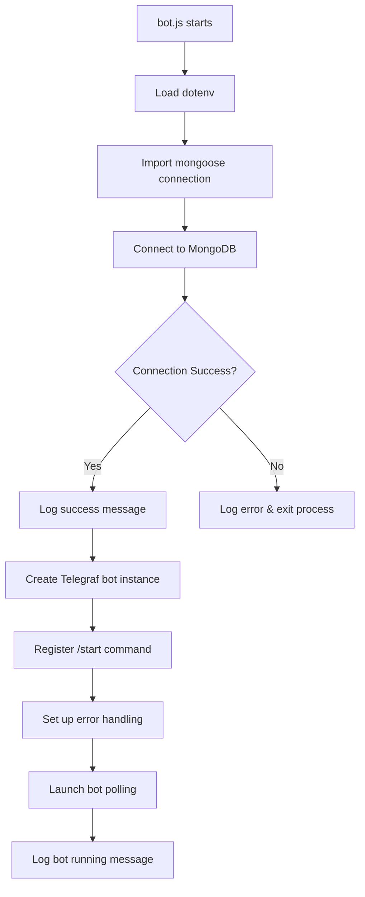

# Design Document: HUMSJ Academic Library Bot - Day 1

## Overview

This design document outlines the technical architecture and implementation details for Day 1 of the HUMSJ Academic Library Bot project. The focus is on establishing a solid foundation: project structure, dependency management, environment configuration, basic bot setup with a /start command, and MongoDB connection preparation.

The bot is built using Node.js with the Telegraf framework for Telegram bot functionality and Mongoose for MongoDB integration. This Day 1 setup creates a clean, modular codebase ready for expansion in subsequent development phases.

## Architecture

The application follows a modular architecture pattern with clear separation of concerns:

```
humsj-telegram-bot/
├── bot.js              # Main entry point - bot initialization and startup
├── .env                # Environment variables (secrets)
├── .env.example        # Environment template for documentation
├── package.json        # Project metadata and dependencies
├── db/
│   └── mongoose.js     # Database connection module
├── commands/           # Future: Command handlers (Day 2+)
├── handlers/           # Future: Event handlers (Day 2+)
├── uploads/            # File storage directories
│   ├── pdf/
│   ├── slides/
│   ├── books/
│   └── exams/
└── utils/              # Future: Utility functions
```

### Application Flow



## Components and Interfaces

### 1. Main Entry Point (bot.js)

**Purpose:** Initialize the application, connect to database, and start the Telegram bot.

**Interface:**
```javascript
// No exports - this is the entry point
// Execution: node bot.js or nodemon bot.js
```

**Responsibilities:**
- Load environment variables via dotenv
- Import and execute database connection
- Create Telegraf bot instance
- Register the /start command handler
- Implement global error handling
- Start bot polling

### 2. Database Connection Module (db/mongoose.js)

**Purpose:** Encapsulate MongoDB connection logic in a reusable module.

**Interface:**
```javascript
// Export: connectDB function
const connectDB = async () => Promise<void>

module.exports = connectDB;
```

**Responsibilities:**
- Read MONGO_URI from environment variables
- Establish connection to MongoDB using Mongoose
- Log connection status (success or failure)
- Exit process gracefully on connection failure

### 3. Environment Configuration (.env)

**Purpose:** Store sensitive configuration data outside of source code.

**Variables:**
| Variable | Description | Example |
|----------|-------------|---------|
| BOT_TOKEN | Telegram Bot API token from @BotFather | 123456:ABC-DEF... |
| MONGO_URI | MongoDB connection string | mongodb://localhost:27017/humsj_bot |

### 4. Package Configuration (package.json)

**Purpose:** Define project metadata, dependencies, and npm scripts.

**Key Scripts:**
| Script | Command | Purpose |
|--------|---------|---------|
| dev | nodemon bot.js | Run bot with auto-restart on file changes |
| start | node bot.js | Run bot in production mode |

**Dependencies:**
| Package | Version | Purpose |
|---------|---------|---------|
| telegraf | ^4.x | Telegram bot framework |
| mongoose | ^8.x | MongoDB ODM |
| dotenv | ^16.x | Environment variable loader |
| axios | ^1.x | HTTP client for future API calls |
| nodemon | ^3.x (dev) | Development auto-restart utility |

## Data Models

For Day 1, no data models or schemas are implemented. The database connection is established to prepare for Day 2+ schema development.

**Future Schema Considerations (Day 2+):**
- User schema for tracking bot users
- Resource schema for academic materials (PDFs, slides, books, exams)
- Category schema for organizing resources


## Correctness Properties

*A property is a characteristic or behavior that should hold true across all valid executions of a system-essentially, a formal statement about what the system should do. Properties serve as the bridge between human-readable specifications and machine-verifiable correctness guarantees.*

Based on the prework analysis, the Day 1 requirements are primarily structural and configuration-based (file existence, dependency presence, specific message responses). These are best validated through example-based tests rather than property-based tests, as they verify specific concrete outcomes rather than universal properties across input spaces.

**Property Reflection:** After reviewing all acceptance criteria, the testable items are predominantly example-based verifications (file exists, dependency present, specific string returned). There are no universal properties that apply across a range of inputs—the requirements specify exact, concrete outcomes.

**Testable Examples (not properties):**
- Project structure verification (directories and files exist)
- Dependency verification (package.json contains specific packages)
- Environment variable presence (.env contains BOT_TOKEN and MONGO_URI)
- /start command response (exact message match)
- Module export verification (connectDB function exists)

Since Day 1 focuses on project initialization and setup, there are no property-based testing opportunities. Property-based testing will become relevant in Day 2+ when data models, user inputs, and resource management are implemented.

## Error Handling

### Bot Error Handling

```javascript
// Global error handler for Telegraf
bot.catch((err, ctx) => {
    console.error(`Error for ${ctx.updateType}:`, err);
});
```

**Error Scenarios:**
| Scenario | Handling | Recovery |
|----------|----------|----------|
| Invalid BOT_TOKEN | Telegraf throws on launch | Log error, process exits |
| Network timeout | Telegraf handles internally | Auto-retry with backoff |
| Command handler error | Caught by bot.catch() | Log error, continue running |

### Database Error Handling

```javascript
// Connection error handling in db/mongoose.js
mongoose.connect(process.env.MONGO_URI)
    .then(() => console.log('MongoDB connected'))
    .catch((err) => {
        console.error('MongoDB connection error:', err);
        process.exit(1);
    });
```

**Error Scenarios:**
| Scenario | Handling | Recovery |
|----------|----------|----------|
| Invalid MONGO_URI | Connection rejected | Log error, exit process |
| MongoDB server down | Connection timeout | Log error, exit process |
| Authentication failure | Connection rejected | Log error, exit process |

## Testing Strategy

### Unit Testing Approach

For Day 1, testing focuses on structural verification and basic functionality:

**Test Categories:**
1. **Structure Tests** - Verify project files and directories exist
2. **Configuration Tests** - Verify package.json and .env are correctly configured
3. **Module Tests** - Verify db/mongoose.js exports the correct function
4. **Integration Tests** - Verify bot responds to /start command correctly

**Testing Framework:** Jest (to be added in Day 2+ if needed)

### Property-Based Testing

Property-based testing is not applicable for Day 1 requirements. The acceptance criteria specify concrete, exact outcomes rather than universal properties. Property-based testing will be introduced in Day 2+ when:
- User input validation is implemented
- Resource search/filtering is added
- Data transformations are required

### Manual Verification Checklist

For Day 1, manual verification is sufficient:

- [ ] `npm install` completes without errors
- [ ] `npm run dev` starts the bot with nodemon
- [ ] Bot responds to /start with the welcome message
- [ ] Console shows "MongoDB connected" message
- [ ] Console shows "Bot is running" message
- [ ] All directories exist in the project structure
